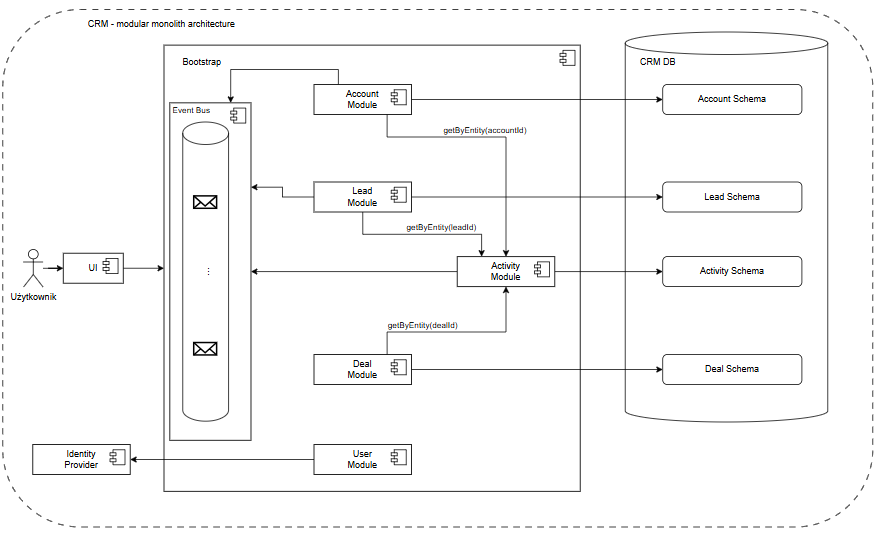

# Modular Monolith CRM Application

CRM application designed and implemented using a modular monolith architecture. This repository is part of a software architecture comparison project,
demonstrating how domain-driven modularity and independent module development, which a microservices architecture is known for, can potentially be achieved, 
while preserving the simplicity of a single deployable unit.

This application has also been implemented in a microservices architecture, allowing for a direct comparison:  
[Go to the microservices version of the project](https://github.com/yfigueira/microservices-crm)

## Application architecture design


## Requirements

You will need Docker to run all the application components. If you don't have Docker installed, follow the [official Docker documentation](https://docs.docker.com/engine/install/).

## Technology
- Backend: __Java 21__ & __Spring Boot 3.5__
- Frontend: __Angular 19__
- Database: __PostgreSQL__
- Authentication: __Keycloak__
- DevOps: __Docker__ & __GitHub Actions__

## Running the Application

1. Clone the repository:
    ```bash
    git clone https://github.com/yfigueira/modular-monolith-crm && cd modular-monolith-crm
    ```
2. Run the project:
   ```bash
   docker-compose up
   ```
3. Once all containers are running, the application will be available on `http://localhost:4200`